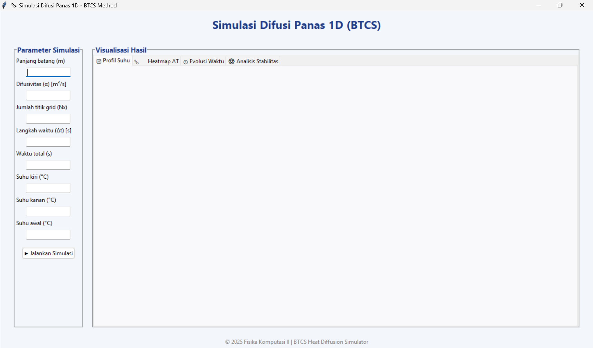

# 🌡️ Simulasi Difusi Panas 1D (Metode BTCS)

Proyek ini merupakan implementasi numerik dari **persamaan difusi panas 1D** menggunakan metode **Backward Time Centered Space (BTCS)**.  
Simulasi ini dilengkapi dengan **antarmuka grafis (GUI)** berbasis **Tkinter** dan **Matplotlib**, yang memudahkan pengguna untuk mengatur parameter fisika dan melihat hasil visualisasi secara interaktif.

---

## 📘 Deskripsi Singkat

Persamaan difusi panas satu dimensi dijelaskan oleh persamaan diferensial parsial berikut:

\[
\frac{\partial T}{\partial t} = \alpha \frac{\partial^2 T}{\partial x^2}
\]

dengan:
- T: suhu (°C)  
- t: waktu (s)  
- x: posisi (m)  
- α: difusivitas termal (m²/s)

Metode **BTCS** digunakan karena bersifat **unconditionally stable**, artinya hasil simulasi tetap stabil untuk berbagai pilihan ∆t dan ∆x.

---

## ⚙️ Fitur Utama

✅ **Input Parameter Fisika**
- Panjang batang (L)
- Difusivitas (α)
- Jumlah titik grid (Nx)
- Langkah waktu (Δt)
- Waktu total simulasi
- Suhu kiri, kanan, dan suhu awal

✅ **Visualisasi Interaktif (4 Tab GUI)**
1. 📈 **Profil Suhu** terhadap posisi (T vs x)
2. 🌡️ **Heatmap ΔT** untuk perubahan suhu sepanjang waktu
3. 🕒 **Evolusi Waktu** pada beberapa titik pengamatan
4. ⚙️ **Analisis Stabilitas Energi**

✅ **Perhitungan Tambahan**
- Rasio stabilitas numerik:  
  \[ r = \frac{\alpha \Delta t}{\Delta x^2} \]
- Waktu karakteristik difusi:  
  \[ t_c = \frac{L^2}{\alpha} \]

✅ **Algoritma Efisien**
Menggunakan **Thomas Algorithm (Tridiagonal Matrix Algorithm - TDMA)**  
untuk menyelesaikan sistem persamaan linear pada skema BTCS.

---

## 🖼️ Tampilan Antarmuka
Berikut contoh tampilan GUI aplikasi:



---

## 🧩 Struktur Proyek

```
BTCS_HeatDiffusion_Simulator/
│
├── main.py              # kode utama simulasi dan GUI
├── README.md            # dokumentasi proyek
├── requirements.txt     # daftar library Python
└── .gitignore           # file pengecualian Git
```

---

## 🧠 Persyaratan Sistem

- Python ≥ 3.9  
- Library yang dibutuhkan:
  - numpy
  - matplotlib
  - tkinter *(sudah bawaan Python)*

---

## 🚀 Cara Menjalankan Program

1. **Clone repository** ke komputer:
   ```bash
   git clone https://github.com/nnuuruull/heat-diffusion-simulator-kelompok2
   cd btcs-heat-diffusion
   ```

2. **Install dependensi:**
   ```bash
   pip install -r requirements.txt
   ```

3. **Jalankan program:**
   ```bash
   python main.py
   ```

4. **Masukkan parameter simulasi** melalui GUI, lalu klik `▶ Jalankan Simulasi`.

---

## 📊 Contoh Hasil Simulasi

- Pola distribusi suhu merata seiring waktu.
- Heatmap menunjukkan difusi panas dari area suhu tinggi ke suhu rendah.
- Grafik energi relatif menunjukkan kestabilan numerik skema BTCS.

---

## 📚 Teori Singkat

Metode BTCS merupakan salah satu skema beda hingga implisit yang digunakan untuk menyelesaikan persamaan difusi.  
Pendekatan ini mendiskretisasi turunan waktu secara mundur (*backward difference*) dan turunan ruang secara terpusat (*centered difference*).  
Kelebihan metode BTCS adalah **stabil tanpa syarat**, sehingga cocok digunakan untuk simulasi difusi jangka panjang.

---

## 🧮 Rumus Diskretisasi

\[
\frac{T_i^{n+1} - T_i^n}{\Delta t} = \alpha \frac{T_{i+1}^{n+1} - 2T_i^{n+1} + T_{i-1}^{n+1}}{\Delta x^2}
\]

yang menghasilkan sistem linear tridiagonal:
\[
-rT_{i-1}^{n+1} + (1 + 2r)T_i^{n+1} - rT_{i+1}^{n+1} = T_i^n
\]

dengan \(r = \frac{\alpha \Delta t}{\Delta x^2}\).

---

## 🧑‍💻 Pengembang
**Nama:** Kelompok 2
**Mata Kuliah:** Fisika Komputasi II
**Institusi:** Universitas Airlangga
**Tahun:** 2025  

---

## 📜 Lisensi
Proyek ini dibuat untuk keperluan akademik dalam mata kuliah **Fisika Komputasi II**.  
Seluruh kode dapat digunakan kembali untuk tujuan pembelajaran, dengan mencantumkan kredit kepada pembuat aslinya.

---

## 🌟 Ucapan Terima Kasih
Terima kasih kepada dosen pengampu dan rekan-rekan yang telah membantu dalam pengembangan proyek ini.
Proyek ini merupakan bagian dari tugas pada mata kuliah **Fisika Komputasi II** dengan topik **Simulasi Difusi Panas 1D**.
# heat-diffusion-simulator-kelompok2
